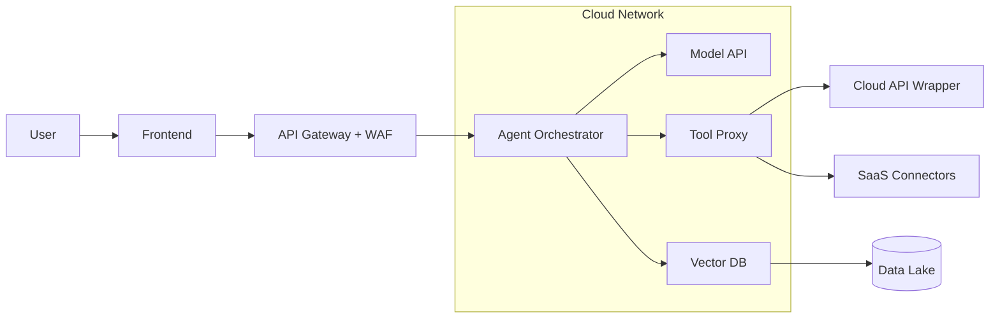
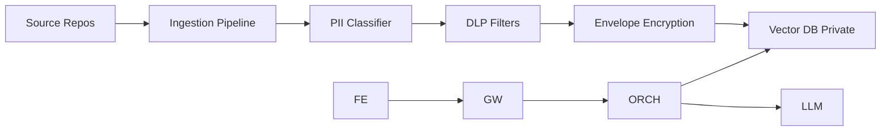
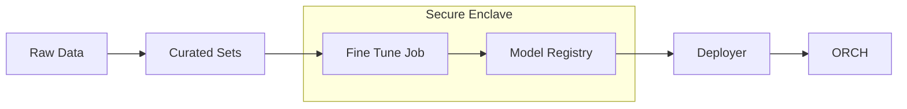

# Reference Architectures

## 1. Minimal Secure Inference with Tooling

**Controls**
- Per tool scoped, short lived credentials
- Policy guardrails with allow-list actions and budgets
- Egress allow-list at NAT or firewall
- Inference request signing and audit trails

## 2. RAG with Sensitive Corpora

**Controls**
- Attribute based access control on documents
- Semantic filtering and content rules before retrieval
- Tenant and project isolation in VDB
- Cryptographic integrity checks on embeddings

## 3. Fine Tuning in Isolated Enclave

**Controls**
- Data use approvals and lineage
- Reproducible training manifests
- Model cards and risk attestations
- Registry with signed artifacts
